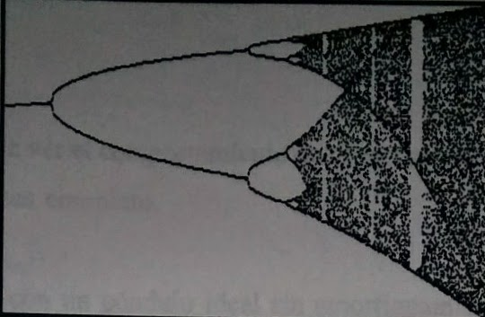

## Ecuación logística
Existen sistemas aparentemente simples y que son capaces de producir comportamiento caótico. Un ejemplo es la ecuación logística. Se trata de un sistema discreto iterativo, la salida se vuelve a introducir y lo que estudiamos es el comportamiento de la sucesión así obtenida. 

Cuando trabajamos en una sección de Poincare' (calculamos la intersección de la trayectoria con una superficie determinada), obtenemos una evolución discreta del sistema. La forma explícita de la ecuación logística es:

	Xn+1 =bXn(1-Xn)

donde X puede variar entre 0 y 1. b actúa como parámetro de control (nos determinará el comportamiento del sistema) y puede tomar valores entre 0 y 4.

Aunque se trata de una sencilla sucesión discreta nos puede servir para ilustrar muchas de las características de sistemas caóticos. Esta ecuación puede servimos como un modelo ecológico simple. La variable X puede representar la cantidad de individuos de una especie .Podemos estudiar su evolución para un valor inicial X0 y un b dados. Si X se hace muy grande (cercana a 1) el alimento escaseará y la población empezará a disminuir como nos indica el término (1-X).

Con una simple calculadora podemos realizar unas cuantas iteraciones de la fórmula. Nos podemos sorprender de los resultados. Vamos a tratarlo de un modo más matemático y empezaremos con un poco de teoría de sucesiones iterativas unidimensionales.

Consideremos la sucesión como una función:
y supondremos que es lo bastante suave como para poder derivarla.
Ua punto fijo será aquel en que se cumple que E-5 La posibilidad
que le sigue en complejidad es una órbita o ciclo, que está formada por puntos
periódicos. Un punto periódico de orden m va a ser un punto fijo de Rx),
siendo m el menor número entero para el que esto se cumple. fe, fe,
son también puntos periódicos de orden m.
Para conocer el comportamiento cerca de un punto fijo estudiaremos el
valor de A-f (5) (el símbolo 'se refiere a la derivada de f respecto de su variable)
Si tenemos en cuenta el carácter iterativo de nuestra sucesión veremos que
podemos clasificar los puntos fijos según el valor de en:
de atracción o estables.
N-0 super estables.
1 de repulsión o inestables
N-1 neutrales
Podemos hacer exactamente la misma clasificación para las órbitas
periódicas. Six ...XH son los miembros de un ciclo de período m. Para estudiar
su evolució
definiremos ahora A-f (x)f (X)...f (X -1)
Con todo esto podemos clasificar los puntos en
a) Puntos fijos
b) Puntos periódicos
c) Puntos eventualmente periódicos, son preimagen de un punto periódico,
es decir existe un m para el que se cumple que f(x) cs periódico.
d) Puntos asintóticamente periódicos, la sucesión contiene una parcial que
converge a un punto periódico.
e) Punto aperiódico que no es de ninguna de las clases anteriores. La
sucesión será estocástica o aperiódica
También pode
estudiar propiedades de f en función de b. Así podemos
fijar nuestra atención en un punto fijo 40 y en su evolución en función de b.
Puede pasar de ser estable a ser inestable dependiendo del valor de 20,
Vamos a entrar ahora de lleno en le estudio de la ecuación logística. Aquí
A-b(1-2x). Vamos a tener dos puntos fijos:
X-0 con A-b
y
X-1
con 2-2-b
Para b-1 el punto X-0 pierde la estabilidad y pasa a ser inestable.x-1-
lo hará para b-3 pues A-1. Aparecerá así un ciclo de periodo 2 para el que se
cumple
operando algebráicamente podemos llegar a que Xi y X2 cumplen
2y2
-(b+1)bx +b+1-0
De aquí podemos calcular el valor de
b2(1-2x1)(1-2x)--b2+2b+4
Vemos que 2-1 para b-3 y que A-1 para b-1+G-3.4495
lo que significa que para este valor de b el ciclo de período dos pierde cstabilidad
y se produce una nueva duplicación, con lo que se creará un ciclo de período 4.
Podemos encontrar valores de b para los que hay nuevas duplicaciones b-3,
3.4495, 3.5441, 3.56421, 3.5688
Estos valores parecen seguir una progresión del tipo
be-b--CF-4
con los valores b--3.5670 2.6327 F-4.6692
Pasados estos valores encontramos una región de comportamiento caótico,
en el que X se mueve por toda la zona de forma imegular.
LJamamos F a la razón de la progresión porque fuc Feigenbaum, un fisico
teórico de partículas quien encontró esta regularidad en los puntos en los que
aparece duplicación
Más importante aún que este hallazgo fue encontrar en una gran clase de
sistemas dinámicos el mismo esquema de duplicaciones de periodo con la misma
constante F. Este comportamiento se mantiene para todas las f(x) bien
comportadas
con fo-f(1) y con un solo máximo en el intervalo (0,1). Este fue
el descubrimiento de la universalidad de las duplicaciones de perfodo en las
transiciones al caos. Posteriormente hablaremos más extensamente de este tema.

El intervalo 6-4) contiene infinitas pequeñas ventanas en la región de movimiento caótico en las que para ciertos valores de b aparecen ciclos estables de periodo m. Por ejemplo desde b-3.8284 hasta b- 3.8415 encontramos un ciclo de periodo 3 que permanece estable. Para el último valor de b encontramos duplicación de período, pasando a un ciclo de periodo 6, luego 12, llegando otra vez a comportamiento caótico.

Diagrama de bifurcación

Estas zonas de comportamiento regular
en medio de la región caótica son
realmente sorprendentes. Es algo parecido a que en un momento dado mientras
estamos moviendo el café para disolver el azúcar, encontráramos que la leche está
por un lado, el café por otro y el azúcar en el fondo, para luego si seguimos
moviendo volver a encontrar la mezcla normal.